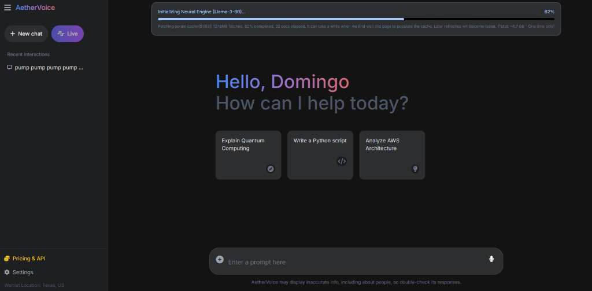
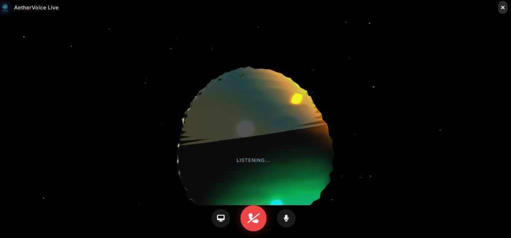

# AetherVoice (WebGPU Experiment)

Estuve probando con `WebLLM` para ver si podía correr modelos tipo Llama-3 directo en el navegador sin pagar servidores. 

La verdad: Se puede, pero pide **mucha máquina**. Si no tienes GPU dedicada (NVIDIA/AMD), va algo lento porque el navegador no está tan optimizado como una app nativa, pero funciona para experimentar.

Básicamente es un chat local que corre 100% en tu compu, así que es privado.


*Interfaz limpia y moderna.*

### Lo que funciona hasta ahora:
- **Audio**: Puedes hablarle y te responde con voz.
- **Vision**: Si compartes pantalla, "ve" lo que haces (útil para debugging).
- **Nebulosa Arcoiris 🌈**: Un visualizador 3D que reacciona a tu voz y cambia de colores.


*Modo "Live" con la esfera reactiva.*
- **Videos**: Si pides un tutorial (tipo "cómo cocinar"), busca en YouTube y te pega el video ahí mismo en el chat.
- **Búsqueda**: Si no sabe algo, usa un script de Python (`server.py`) para buscar en Google.

### Cosas técnicas / Problemas
El frontend es JS puro (vanilla), nada de React porque me daba pereza configurar el build system y quería mantenerlo simple.

Me costó bastante el tema de la memoria RAM. Si recargas la página mucho, Chrome se come la memoria porque no libera los modelos viejos rápido. También tuve problemas con Google bloqueando las búsquedas si hacía muchas seguidas, así que le puse un fallback a DuckDuckGo.

### Para probarlo
Solo necesitas Python para el proxy de búsqueda.

```bash
pip install -r requirements.txt
python server.py
```
Luego entra a `localhost:8097`.
(Ojo: la primera vez tarda descargando los 4GB del modelo).
